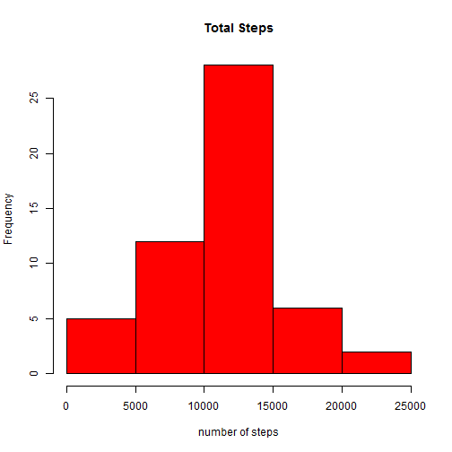
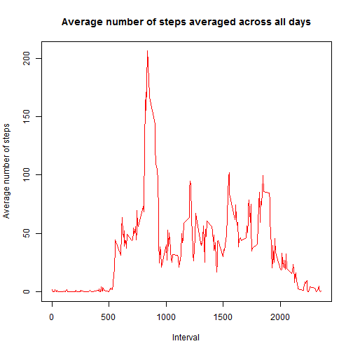
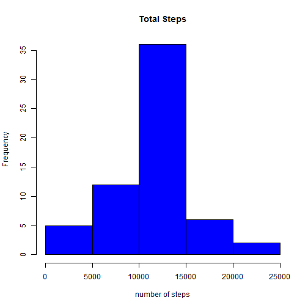
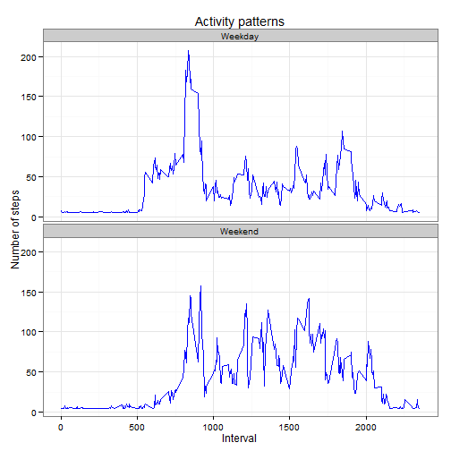

# Reproducible Research: Peer Assessment 1

## Loading and preprocessing the data
Load required libraries

```r
library(dplyr)
library(ggplot2)
library(gam)
library(knitr)
```

Download Activity file

```r
temp <- tempfile()
fileUrl<-"http://d396qusza40orc.cloudfront.net/repdata%2Fdata%2Factivity.zip"
if (!file.exists(fileUrl)) {
  download.file(fileUrl,temp)
}
file<-unzip(temp,list=F,overwrite=T)
unlink(temp)

rdata<-read.csv(file,header = TRUE,sep = ",",as.is=TRUE) 
```
Display the first rows

```r
head(rdata)
```

```
##   steps       date interval
## 1    NA 2012-10-01        0
## 2    NA 2012-10-01        5
## 3    NA 2012-10-01       10
## 4    NA 2012-10-01       15
## 5    NA 2012-10-01       20
## 6    NA 2012-10-01       25
```

## What is mean total number of steps taken per day?
Omit missing values

```r
cleanrdata<-rdata[!is.na(rdata$steps),]
```


```r
m<-cleanrdata %>%
  group_by(date) %>%
  summarise(total_steps = sum(steps))
```
Histogram of the total number of steps taken each day

```r
hist(m$total_steps, col = "red",
     main = "Total Steps", 
     xlab = "number of steps")
```

 

Mean and media of total number of steps taken per day

```r
mean(m$total_steps)
```

```
## [1] 10766.19
```

```r
median(m$total_steps)
```

```
## [1] 10765
```

## What is the average daily activity pattern?
Average number of steps averages across all days

```r
k<-cleanrdata %>%
  group_by(interval) %>%
  summarise(mean_steps = mean(steps))
```
Time series plot

```r
plot(k$interval, k$mean_steps, type='l', col="red", 
     main="Average number of steps averaged across all days", 
     xlab="Interval",ylab="Average number of steps")
```

 

Which 5-minute interval,on average across all days in the dataset, contains the maximun number of steps?

```r
row_id <- which.max(k$mean_steps)
k[row_id,]
```

```
## Source: local data frame [1 x 2]
## 
##     interval mean_steps
## 104      835   206.1698
```

## Imputing missing values
Total number of missing values (rows with NAs)

```r
length(which(is.na(rdata$steps)))
```

```
## [1] 2304
```
The strategy is tu use the gam library, NAs are replaced by the mean of the non-missing values

```r
replaced.rdata<-na.gam.replace(rdata)
```
Total number of steps taken each day

```r
r<-replaced.rdata %>%
  group_by(date) %>%
  summarise(total_steps = sum(steps))
```
Histogram of the total number of steps taken each day

```r
hist(r$total_steps, col = "blue",
     main = "Total Steps", 
     xlab = "number of steps")
```

 

Mean and median total number of steps taken each day

```r
mean(r$total_steps)
```

```
## [1] 10766.19
```

```r
median(r$total_steps)
```

```
## [1] 10766.19
```
### Do these values differ from the estimates from the first part of the ### assignment ?

Omitting missing values 
- mean   : 10766.19
- median : 10765

After filling the missing values
- mean   : 10766.19
- median : 10766.19

Only the median has a slight difference.

### What is the impact of imputing missing data on the estimates of the ### total daily number of steps

WE can see that the mean value did not change and the median matches the mean.Imputing missing data did not affect our estimates

## Are there differences in activity patterns between weekdays and weekends?

Create a new factor variable in the dataset with two levesl "weekday" and "weekend" indicating whether a given date is a weekday or weekend day

```r
Sys.setlocale("LC_TIME", "English")
```

```
## [1] "English_United States.1252"
```

```r
day <- weekdays(as.Date(replaced.rdata$date))
daylevel <- vector()
for (i in 1:nrow(replaced.rdata)) {
  if (day[i] == "Saturday") {
    daylevel[i] <- "Weekend"
  } else if (day[i] == "Sunday") {
    daylevel[i] <- "Weekend"
  } else {
    daylevel[i] <- "Weekday"
  }
}
replaced.rdata$daylevel <- factor(daylevel)
```
Make a panel plot containig a time series plot of the 5-minute interval(x-axis) and the average number of steps taken, averaged across all weekday days or weekend days (y-axis) 

```r
table_interval <- aggregate(steps ~ interval+daylevel, replaced.rdata, mean)

ggplot(table_interval, aes(x=interval, y=steps)) + 
  geom_line(color="blue") + 
  facet_wrap(~ daylevel, nrow=2, ncol=1) +
  labs(x="Interval", y="Number of steps") +
  theme_bw()+labs(title="Activity patterns")
```

 

